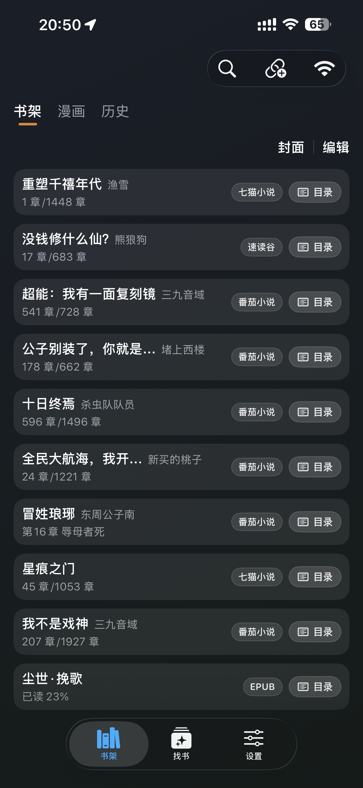
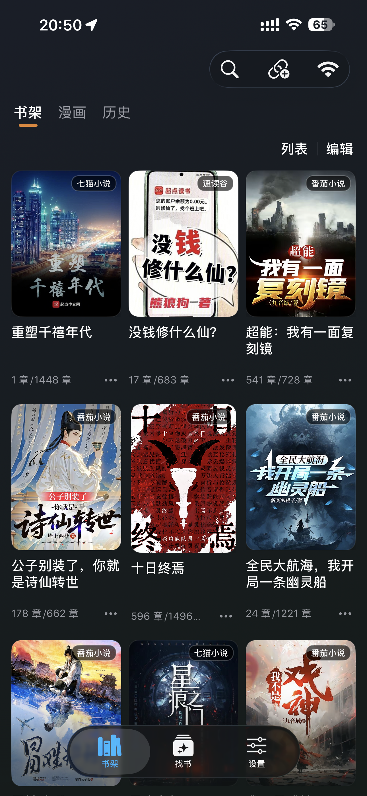
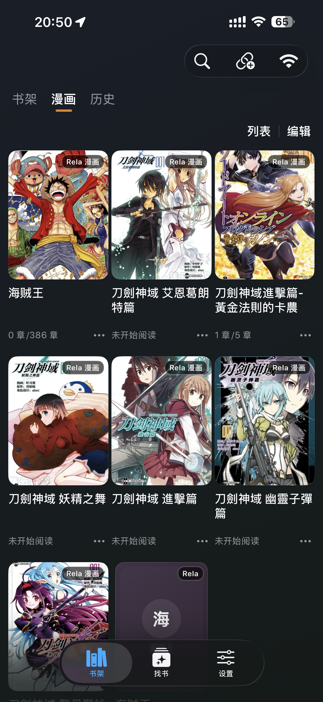

# Readerme 

一个ios上的小说阅读器。

支持 ios16+,可巨魔可自签。
可wifi导入txt,epub,mobi,漫画zip,自定义字体.

---
## 界面预览
  
## 推荐书源
```
https://www.yckceo.com/yuedu/shuyuan/json/id/6645.json
```
```
https://www.yckceo.com/yuedu/shuyuan/json/id/6965.json
```
```
https://www.yckceo.com/yuedu/shuyuan/json/id/6949.json
```
```
https://www.yckceo.com/yuedu/shuyuan/json/id/7018.json
```
```
https://www.yckceo.com/yuedu/shuyuan/json/id/4810.json
```
---

## 其他

- 书源规则兼容目标参考 Legado / 阅读 3.0 生态
- 部分复杂书源仍在持续增强兼容中

---
## 常见问题

**TTS朗读音色需要在设置，阅读下选择，使用微软TTS。朗读时有高亮跟随，但是跟随速度有差异（- - 也不是不能用）**
carplay没有权限，只能走系统音频通道，好在封面之类的都正常。
**关于漫画**
漫画我看的不是太多,目前只支持漫画流一种,即从开头一直刷到结束.可无缝切换下一话
